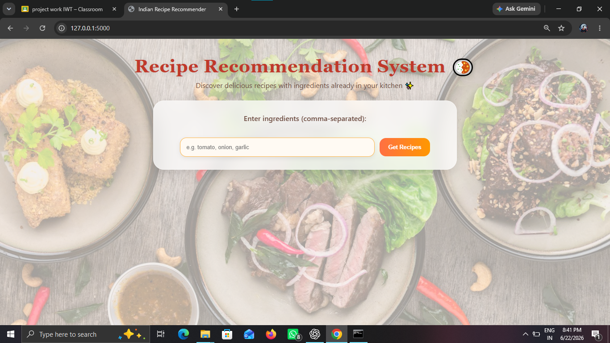
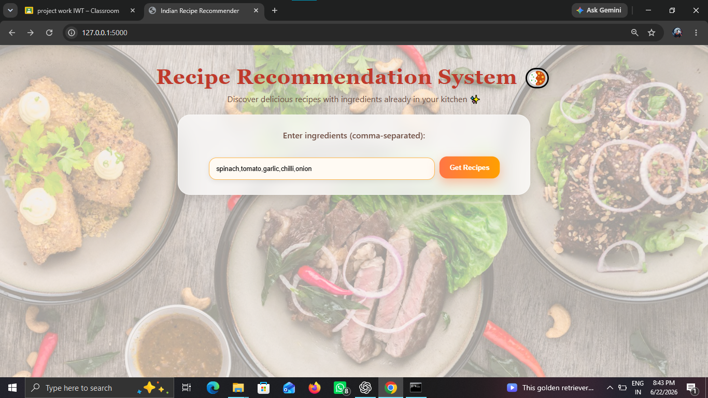
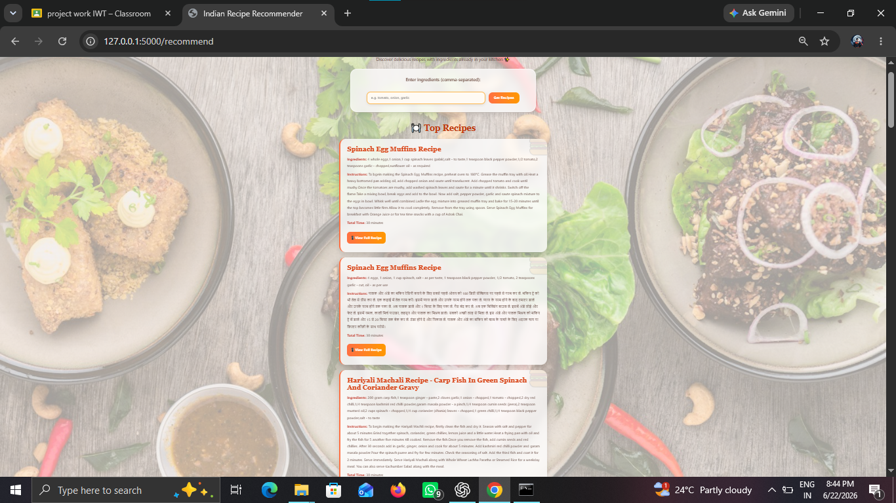
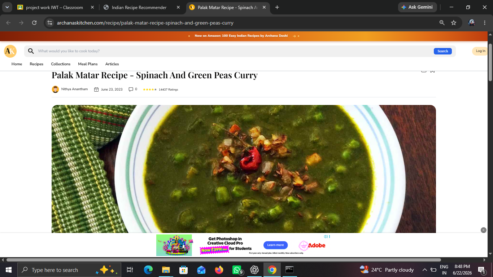

<h1>🍽️ Ingredient-Based Recipe Recommender</h1>

<h3>A Machine Learning-Based Recipe Recommendation System</h3>

  <i>Find recipes based on the ingredients you already have.</i>

<h2>📌 About the Project</h2>

The <strong>Ingredient-Based Recipe Recommender</strong> is a
machine learning-based web application developed as an
<strong>academic group project</strong> during our BCA program.

The main objective of this project is to help users discover suitable
recipes based on the ingredients they already have available. Instead
of manually searching through a large collection of recipes, users can
enter the ingredients available to them and receive relevant recipe
recommendations.

The system processes the ingredients provided by the user and compares
them with the ingredients available in the recipe dataset. The
recommendation process uses <strong>TF-IDF Vectorization</strong> and
<strong>Cosine Similarity</strong> to identify recipes that closely
match the user's input.

<h2>🎯 Problem Statement</h2>

People often have ingredients available at home but may not know what
recipes they can prepare using them. Searching manually for recipes
that match a particular combination of ingredients can be
time-consuming.

This project aims to simplify the process by allowing users to enter
their available ingredients and automatically receive suitable recipe
recommendations.

<h2>✨ Features</h2>

<ul>

<li>
<strong>🥕 Ingredient-Based Recipe Recommendations</strong>

Recommends recipes based on the ingredients entered by the user.

</li>

<li>
<strong>🔍 Ingredient Validation</strong>

Validates user-entered ingredients using a simplified valid ingredient
list.

</li>

<li>
<strong>🧹 Ingredient Processing</strong>

Processes and prepares ingredient information before performing recipe
matching.

</li>

<li>
<strong>🧠 TF-IDF Vectorization</strong>

Converts textual ingredient information into numerical
representations.

</li>

<li>
<strong>📊 Cosine Similarity</strong>

Calculates the similarity between the user's ingredients and the
ingredients associated with recipes.

</li>

<li>
<strong>🍲 Recipe Recommendations</strong>

Displays recipes that closely match the ingredients provided by the
user.

</li>

<li>
<strong>🌐 Web-Based Interface</strong>

Provides a simple and user-friendly interface for interacting with
the recommendation system.

</li>

</ul>

<h2>🧠 How It Works</h2>

The recommendation process follows these steps:

<pre>
User enters ingredients
          ↓
Ingredient Validation
          ↓
Ingredient Processing
          ↓
TF-IDF Vectorization
          ↓
Cosine Similarity
          ↓
Recipe Similarity Ranking
          ↓
Recommended Recipes
</pre>

<h3>1. User Input</h3>

The user enters the ingredients that are currently available to them.

<h3>2. Ingredient Validation</h3>

The entered ingredients are checked against the project's simplified
valid ingredient list. This helps the system process recognized
ingredients before generating recommendations.

<h3>3. Ingredient Processing</h3>

The valid ingredients are processed into a suitable format for
comparison with the recipe dataset.

<h3>4. TF-IDF Vectorization</h3>

<strong>TF-IDF (Term Frequency-Inverse Document Frequency)</strong>
is used to convert ingredient information into numerical
representations.

<h3>5. Cosine Similarity</h3>

<strong>Cosine Similarity</strong> is used to compare the user's
ingredient vector with the recipe ingredient vectors.

<h3>6. Recipe Recommendation</h3>

Recipes with higher similarity to the user's ingredients are selected
and displayed as recommendations.

<h2>🛠️ Technologies Used</h2>

<table>
<thead>
<tr>
<th>Technology</th>
<th>Purpose</th>
</tr>
</thead>

<tbody>

<tr>
<td>🐍 <strong>Python</strong></td>
<td>Core programming and recommendation logic</td>
</tr>

<tr>
<td>🌐 <strong>Flask</strong></td>
<td>Backend and web application framework</td>
</tr>

<tr>
<td>🐼 <strong>Pandas</strong></td>
<td>Recipe dataset handling and processing</td>
</tr>

<tr>
<td>🤖 <strong>Scikit-learn</strong></td>
<td>TF-IDF Vectorization and Cosine Similarity</td>
</tr>

<tr>
<td>🧱 <strong>HTML</strong></td>
<td>Frontend structure</td>
</tr>

<tr>
<td>🎨 <strong>CSS</strong></td>
<td>Frontend styling</td>
</tr>

<tr>
<td>📄 <strong>CSV</strong></td>
<td>Recipe dataset storage</td>
</tr>

</tbody>
</table>

<h2>📸 Project Screenshots</h2>

<h3>🏠 Home Page</h3>

The home page provides the main interface where users can enter their
available ingredients and begin the recipe recommendation process.

<h3>🥕 Ingredient Input</h3>

Users can enter the ingredients they currently have available. The
system validates and processes the entered ingredients.

<h3>🍲 Recipe Recommendations</h3>

The system displays recipes that match the ingredients entered by the
user.

<h3>📋 Recipe Details</h3>

The recommended recipe information is presented to the user for easier
understanding and use.

<h2>📂 Project Structure</h2>

<pre>
Ingredient-Based-Recipe-Recommender/
│
├── app.py
├── simple_ingred.py
├── archana.csv
├── simplified_valid_ingredients.txt
│
├── home-page.png
├── Ingredients.png
├── receipe.png
├── url_image.png
├── url_image2.png
│
└── templates/
    └── index.html
</pre>

<h2>👩‍💻 My Contribution</h2>

This application was developed as a
<strong>group project</strong> by a team of three members.
I contributed to multiple areas of the project, including the frontend,
backend, recipe set and processing, and ingredient management.

<h3>🎨 Frontend Enhancement</h3>

<ul>
<li>Enhanced the frontend interface of the application.</li>
<li>Improved the overall layout and visual presentation.</li>
<li>Worked on improving the usability and user experience.</li>
<li>Contributed to integrating the frontend with the Flask backend.</li>
</ul>

<h3>⚙️ Backend Development</h3>

<ul>
<li>
Contributed to backend development using
<strong>Python and Flask</strong>.
</li>

<li>
Worked on connecting user input with the recipe recommendation
functionality.
</li>

<li>
Contributed to processing and handling ingredient-based requests.
</li>
</ul>

<h3>🍲 Recipe Set and Processing</h3>

<ul>
<li>
Worked on the recipe set and dataset used by the recommendation system.
</li>

<li>
Contributed to the code used to process and utilize recipe information.
</li>

<li>
Worked with recipe data required for generating relevant
recommendations.
</li>
</ul>

<h3>🥕 Simplified Ingredient List</h3>

<ul>
<li>
Created and maintained the
<strong>simplified valid ingredient list</strong>.
</li>

<li>
Contributed to ingredient validation and processing.
</li>

<li>
Helped simplify ingredient names so that user input could be processed
more effectively by the recommendation system.
</li>
</ul>

<h3>🔗 Integration and Testing</h3>

<ul>
<li>
Contributed to integrating the frontend, backend, ingredient processing,
and recipe recommendation components.
</li>

<li>
Tested the application with different ingredient inputs and recipe
combinations.
</li>
</ul>

<h2>📊 Recommendation Technique</h2>

<h3>TF-IDF</h3>

<strong>TF-IDF (Term Frequency-Inverse Document Frequency)</strong>
is used to represent ingredient information numerically. It helps
represent the importance of ingredient terms within the recipe data.

<h3>Cosine Similarity</h3>

<strong>Cosine Similarity</strong> is used to compare the numerical
representation of the user's ingredients with the recipe ingredient
vectors.

The similarity scores help the system identify recipes that are more
closely related to the user's ingredient input.

<h2>🚀 Getting Started</h2>

<h3>Prerequisites</h3>

<ul>
<li>Python 3.x</li>
<li>pip</li>
<li>Git</li>
</ul>

<h3>Clone the Repository</h3>

<pre>
git clone https://github.com/AnkithaDevadiga17/Ingredient-Based-Recipe-Recommender.git
</pre>

<h3>Navigate to the Project Directory</h3>

<pre>
cd Ingredient-Based-Recipe-Recommender
</pre>

<h3>Install Dependencies</h3>

<pre>
pip install flask pandas scikit-learn
</pre>

<h3>Run the Application</h3>

<pre>
python app.py
</pre>

After running the application, open the local Flask URL displayed in
the terminal to access the recipe recommendation system.

<h2>🧪 Example Usage</h2>

<pre>
Input:
Tomato, Onion, Garlic

        ↓

Ingredient Validation

        ↓

Ingredient Processing

        ↓

Recipe Matching

        ↓

Recommended Recipes
</pre>

The system analyzes the entered ingredients and displays recipes that
best match the available ingredients.

<h2>🔮 Future Improvements</h2>

<ul>
<li>📚 Expand the recipe dataset.</li>
<li>🥗 Add dietary preference filters.</li>
<li>🌍 Add cuisine-based filtering.</li>
<li>⏱️ Add cooking-time filters.</li>
<li>🖼️ Add more recipe images.</li>
<li>⭐ Allow users to save favorite recipes.</li>
<li>👤 Add personalized recommendations.</li>
<li>📱 Improve mobile responsiveness.</li>
<li>☁️ Deploy the application for public access.</li>
</ul>

<h2>👥 Project Type</h2>

<strong>Academic Group Project</strong>

This project was developed collaboratively by a team of three members
as part of our academic project. Each team member contributed to
different aspects of the application.

<h2>👩‍💻 Contributor</h2>

<h3>Ankitha Devadiga</h3>

BCA Graduate | Currently pursuing MCA

<strong>Contributions:</strong>

<ul>
<li>Frontend Enhancement</li>
<li>Backend Development</li>
<li>Recipe Set and Processing</li>
<li>Simplified Ingredient List</li>
<li>Project Integration and Testing</li>
</ul>

<h2>📄 License</h2>

This project was developed for academic and educational purposes.

<h3>🍴 Ingredient-Based Recipe Recommender</h3>

<i>Turning available ingredients into recipe ideas.</i>

